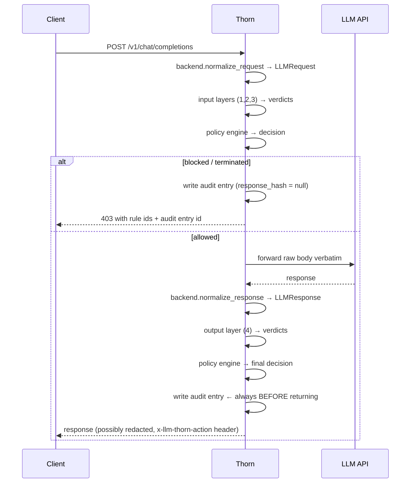

# Architecture

## The big picture

```
[Client] → [Thorn] → [LLM API]
                │
    ┌───────────▼──────────────┐
    │  Layer 1: Heuristic      │  Pattern matching — <5ms, no I/O
    │  Layer 2: Semantic       │  Ollama intent classifier — <2s
    │  Layer 3: Context        │  Multi-turn risk scoring — <10ms
    │  Layer 4: Output         │  Response anomaly detection — <5ms
    │  Layer 5: Safety         │  Harmful-content judge (CoJP) — <2s
    │                          │
    │  Policy Engine           │  YAML rule evaluation
    │  Audit Logger            │  Hash-chained SQLite log
    └──────────────────────────┘
```

One request's life:



## Components

### The shared pipeline (`llm_thorn/core/pipeline.py`)

All three integration modes — reverse proxy, SDK wrapper, ASGI middleware —
construct the same `DetectionPipeline`. The modes are thin adapters that
parse their transport's request shape and hand normalized models to the
pipeline. This is what makes invariant 6 (*identical inputs produce
identical audit logs regardless of mode*) structurally true rather than a
testing aspiration.

The pipeline:

1. loads the session snapshot,
2. runs every enabled input layer (awaiting async ones — the semantic
   layer's Ollama call never blocks the event loop),
3. evaluates the policy,
4. records the turn's risk delta against the session,
5. writes the audit entry for blocked requests immediately,
6. exposes `inspect_response` for the output half, which always writes the
   audit entry before returning.

A layer that raises does not crash anything: the exception is logged, and
the policy's `defaults.on_layer_error` decides fail-open (`allow` — the
remaining layers' verdicts still count) or fail-closed (`block`).

### Detection layers (`llm_thorn/layers/`)

| | Heuristic (L1) | Semantic (L2) | Context (L3) | Output (L4) |
|---|---|---|---|---|
| Inspects | input | input | input | output |
| Mechanism | 60+ compiled regexes in 6 categories | few-shot JSON classifier on local Ollama | probe signals + accumulated session risk | leak/injection/PII regexes vs the *original request* |
| I/O | none | HTTP to Ollama (async) | none (session snapshot pre-loaded) | none |
| Budget | <5ms | <2s | <10ms | <5ms |

**Layer 3 is the differentiator.** Every layer verdict contributes a risk
delta to the session (`malicious` +3.0, `suspicious` +1.5, plus the context
layer's own probe-signal scoring, capped at 3.0/turn so a single message
cannot saturate the scale). Risk accumulates in SQLite across turns and the
context layer judges the *projected total*, not the message. Sessions reset
on TTL expiry or max turns; terminated sessions stay blocked until reset.

Layers are **stateless by contract** — anything per-conversation lives in
the `SessionContext` snapshot they receive. That is what makes community
layers safe to drop into the stack.

### Policy engine (`llm_thorn/policy/`)

Policies are Pydantic-validated at startup (`extra="forbid"` — typos are
startup errors, not silent no-ops). At runtime each rule reads the verdicts
of its target layer; a rule's `verdict:` condition is satisfied by that
verdict *or stricter* (a `suspicious` rule fires on `malicious` too). When
several rules fire, the most severe action wins:

```
terminate_session > block > redact > warn > allow
```

### Session store (`llm_thorn/core/session.py`)

SQLite, two tables: `sessions` (turn count, accumulated risk, terminated
flag) and `session_events` (the flagged-verdict history the context layer
reads for repeat-offender weighting). Reads are on the Layer-3 hot path and
stay under the 10ms budget: single indexed-key lookups, no joins.

### Audit log (`llm_thorn/core/audit.py`)

Append-only SQLite table where each entry stores

```
chain_hash = sha256(previous_chain_hash + canonical_json(entry_without_chain_hash))
```

with `GENESIS_HASH = "0" * 64` seeding the first entry. The canonical
serialization is deterministic (sorted keys, fixed separators), so
`llm-thorn audit verify` can recompute the entire chain and report the exact
entry where integrity breaks — modification, deletion, and reordering are
all detected.

**Known limitation (by design of pure hash chains):** deleting entries
*from the tail* leaves a valid shorter chain. Detecting truncation requires
anchoring the latest chain hash externally — e.g. a cron job that copies
the head hash to a separate system, or publishing it to a transparency log.
This is pinned by a test (`test_deleting_last_entry_is_undetectable_but_documented`)
so any future fix is a deliberate change.

Request/response bodies are stored as **sha256 hashes, not plaintext** —
the audit log proves *what happened* without becoming a second copy of your
users' conversations.

### Backends (`llm_thorn/backends/`)

Backends normalize provider wire formats into `LLMRequest`/`LLMResponse`
**before any layer runs** (invariant 3: layers never see provider dicts).
Provider quirks are absorbed here — e.g. the Anthropic backend folds the
top-level `system` parameter into a leading system message so Layer 4's
prompt-leak detection works identically across providers. Non-inspected
paths (model lists, embeddings) are forwarded verbatim.

## Performance budgets

These are constraints, not targets — exceeding them is a bug:

| Component | Budget | Enforced by |
|---|---|---|
| Heuristic layer | < 5ms | `test_heuristic_layer.py::test_performance_budget` |
| Semantic layer | < 2000ms | constructor timeout |
| Context layer | < 10ms | `test_context_layer.py::test_performance_budget` |
| Output layer | < 5ms | `test_output_layer.py::test_performance_budget` |
| Audit write | < 5ms | `test_audit_log.py::test_write_performance_budget` |

## Key invariants

1. A layer exception never causes an unhandled 500 — caught in the
   pipeline, converted to `on_layer_error` behavior.
2. The audit entry is written **before** the response is returned. An
   unlogged response is a compliance failure.
3. Layers receive normalized models only; backend normalization happens
   first.
4. `BaseLayer` is stable within a major version.
5. Policy errors are actionable messages naming the failing field, never
   stack traces.
6. All three integration modes produce identical audit logs for identical
   inputs — guaranteed by sharing the pipeline.
